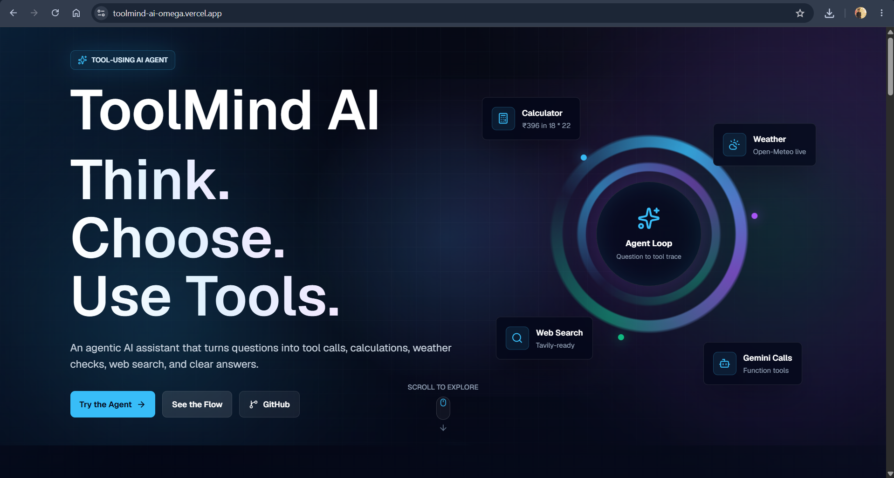
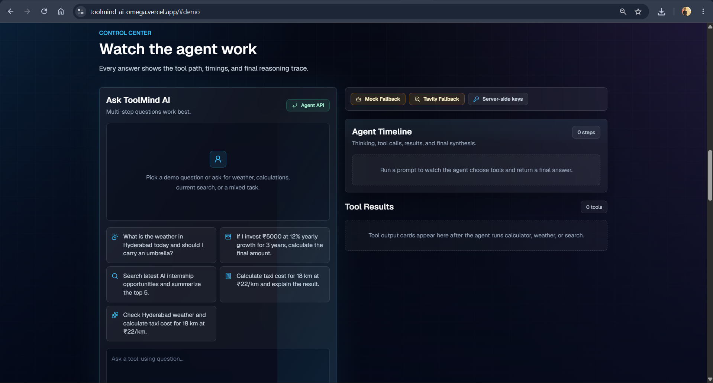
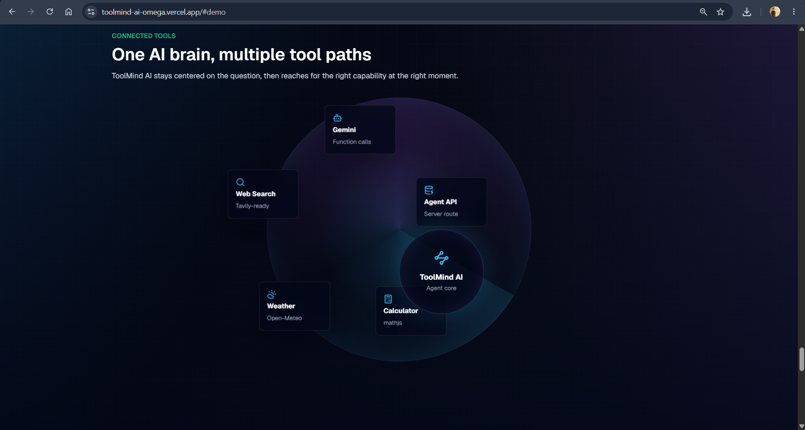
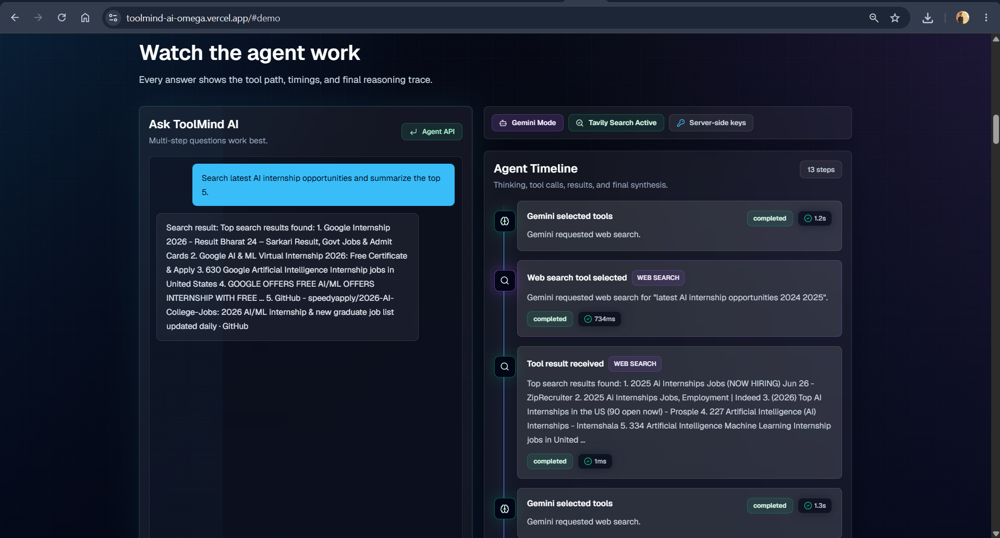
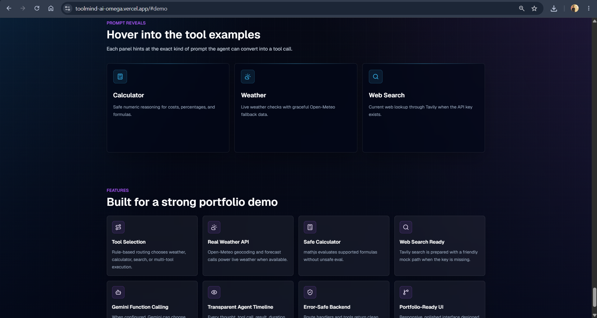
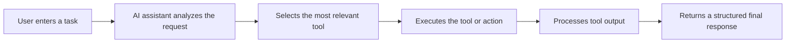

# ToolMind AI — Agentic AI Tool-Use Platform

A full-stack AI platform that demonstrates how an intelligent assistant can reason, choose tools, execute tasks, and return structured results through a modern web interface.

**Live Demo:** [https://toolmind-ai-omega.vercel.app/#demo](https://toolmind-ai-omega.vercel.app/#demo)

## Overview

ToolMind AI is a portfolio-focused agentic AI demo built around transparent tool use. Instead of hiding the assistant's process, the app shows the steps behind each answer: request analysis, tool selection, tool execution, result handling, and final response generation.

The current implementation supports calculator, weather, and web search workflows. Gemini function calling is available when server-side credentials are configured, and the app falls back to a local rule-based agent when Gemini is not configured or unavailable.

## Key Features

- Agentic AI workflow with visible thinking, tool, result, and final-answer steps
- Tool selection for calculator, weather, web search, and multi-tool prompts
- Gemini-powered function calling when `GEMINI_API_KEY` is configured
- Rule-based mock fallback mode for demos without API keys
- Server-side API route for agent execution
- Safe calculator powered by `mathjs`
- Weather lookup through Open-Meteo with fallback data
- Tavily web search integration with mock results when no key is configured
- Dashboard-style demo UI with prompt input, sample questions, response panel, timeline, and tool result cards
- Error handling, loading states, duration tracking, and safe JSON fallbacks
- Responsive dark premium UI
- Vercel deployment-ready Next.js app

## Tech Stack

- Next.js App Router
- React
- TypeScript
- Tailwind CSS
- Framer Motion
- GSAP
- lucide-react
- mathjs
- Gemini API
- Tavily Search API
- Open-Meteo API
- Vercel

## Screenshots











TODO: Add `./screenshots/light-mode.png` only after a light-mode UI is implemented.

## How It Works



## Agent and Tool Workflow

The assistant receives a user task from the demo interface and sends it to the agent API route. The server decides whether to use Gemini function calling or the local fallback agent. The selected path chooses one or more tools, runs them on the server, captures the output, and returns a structured response with timeline steps and tool results.

Current tools:

- **Calculator:** Evaluates supported numeric expressions, taxi-cost prompts, percentages, GST reverse calculations, and compound-growth examples with `mathjs`.
- **Weather:** Looks up city coordinates and current weather data through Open-Meteo, with fallback weather data if the live API is unavailable.
- **Web Search:** Uses Tavily when `TAVILY_API_KEY` exists, otherwise returns a clear mock result that explains how to enable real search.

## Environment Variables

Create `.env.local` from `.env.example` when you want to enable live AI/search integrations:

```env
GEMINI_API_KEY=
GEMINI_MODEL=gemini-3.5-flash
TAVILY_API_KEY=
```

Security notes:

- Do not commit `.env.local`.
- Gemini and Tavily keys must stay server-side.
- Add the same environment variables in Vercel before deployment.
- The app can still run without keys by using fallback mode and mock search behavior.

## Local Setup

```bash
npm install
npm run dev
npm run build
```

Open [http://localhost:3000](http://localhost:3000) after starting the dev server.

Optional type check:

```bash
npm run type-check
```

## Usage

1. Open the app.
2. Enter a task or select one of the demo prompts.
3. Let the assistant choose or run a tool.
4. Review the agent timeline, tool result cards, and final answer.
5. Try weather, calculation, search, and mixed tool-use examples.

Example prompts:

- What is the weather in Hyderabad today and should I carry an umbrella?
- If I invest Rs. 5000 at 12% yearly growth for 3 years, calculate the final amount.
- Search latest AI internship opportunities and summarize the top 5.
- Calculate taxi cost for 18 km at Rs. 22/km and explain the result.
- Check Hyderabad weather and calculate taxi cost for 18 km at Rs. 22/km.

## Deployment

The project is deployed on Vercel:

[https://toolmind-ai-omega.vercel.app/#demo](https://toolmind-ai-omega.vercel.app/#demo)

For production deployments, configure `GEMINI_API_KEY`, optional `GEMINI_MODEL`, and optional `TAVILY_API_KEY` in the Vercel project settings.

## Project Status

Production-style portfolio project / active development.

## Future Improvements

- More tool integrations
- User authentication
- Tool execution history
- Saved workflows
- Real-time streaming responses
- Team workspace
- API usage analytics
- Advanced agent memory
- Role-based access
- More reliable tool error recovery
- Citation display for Tavily search results
- Automated tests for tool routing and fallback behavior

## License / Portfolio Note

This project is built for learning, portfolio, and agentic AI workflow demonstration.
