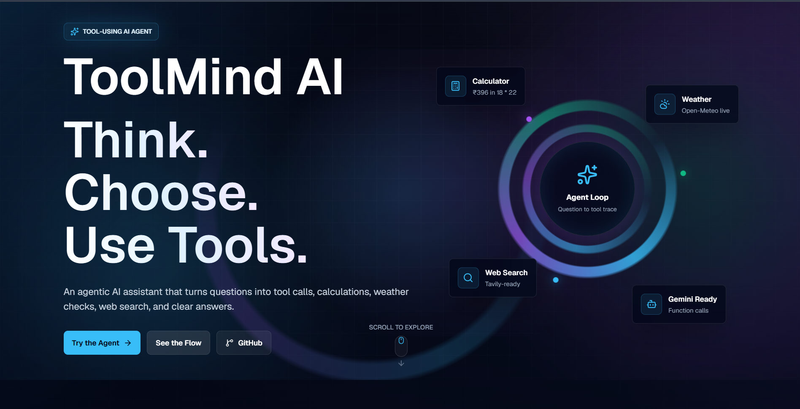

# ToolMind AI

**ToolMind AI - Agentic Tool-Using Research Assistant**

Live demo: https://toolmind-ai-omega.vercel.app/

Screenshot: 

ToolMind AI is a modern full-stack AI agent web app that demonstrates transparent tool use. It answers multi-step questions by routing to tools such as calculator, weather, and web search, then returns a readable trace of each agent step.

## Problem Statement

Most chatbot demos hide how the answer was produced. ToolMind AI shows the agentic loop clearly:

```txt
User question -> Agent thinking -> Tool selected -> Tool running -> Tool result -> Final answer
```

The app supports safe fallback mode when Gemini or Tavily keys are missing, while keeping calculator, weather, and tool-trace demos usable.

## Features

- Tool router for calculator, weather, web search, and multi-tool prompts
- Open-Meteo weather API with fallback data
- Safe calculator powered by mathjs, with no unsafe eval
- Tavily-ready web search with mock results when no key is configured
- Gemini-ready server utility for future function calling
- Animated transparent agent timeline with duration tracking
- Friendly error handling for invalid input, tool failures, and missing keys
- Responsive dark premium UI built with Tailwind CSS and Framer Motion

## Tech Stack

- Next.js App Router
- TypeScript
- Tailwind CSS
- Framer Motion
- lucide-react
- mathjs
- Next.js Route Handlers

## Architecture

```txt
User Input -> Agent API -> Tool Router -> Calculator / Weather / Web Search -> Final Answer
```

The backend API lives in `app/api/agent/route.ts`. It validates the request, checks whether Gemini is configured, and falls back to the mock agent when Gemini function calling is not available. Tool modules stay server-safe and never expose API keys to client components.

## Agent Flow

1. The user submits a question.
2. The mock agent analyzes the text and selects the required tools.
3. Tools run on the server with try/catch and timeout handling.
4. Tool results are added to the trace with timings.
5. The agent generates a useful final answer from the tool outputs.

## Tools Used

- **Weather:** Open-Meteo geocoding and forecast APIs
- **Calculator:** mathjs for safe expression parsing
- **Web Search:** Tavily API when `TAVILY_API_KEY` is present, otherwise mock search

## API Status

- Open-Meteo: Works without API key
- Calculator: Works locally with mathjs
- Tavily: Requires `TAVILY_API_KEY`
- Gemini: Requires `GEMINI_API_KEY`

## Visual Experience

ToolMind AI uses a futuristic scroll-driven interface with portal-inspired animations, animated agent timelines, glowing tool cards, and transparent tool-use traces to make the agentic loop easy to understand.

## Environment Variables

Create `.env.local` from `.env.example` when you want real keys:

```env
GEMINI_API_KEY=
TAVILY_API_KEY=
NEXT_PUBLIC_APP_URL=http://localhost:3000
```

The app runs without `.env.local`.

## Run Locally

```bash
npm install
npm run dev
```

Open `http://localhost:3000`.

## Build Checks

```bash
npm run build
npm run type-check
```

## Demo Questions

- What is the weather in Hyderabad today and should I carry an umbrella?
- If I invest ₹5000 at 12% yearly growth for 3 years, calculate the final amount.
- Search latest AI internship opportunities and summarize the top 5.
- Calculate taxi cost for 18 km at ₹22/km and explain the result.
- Check Hyderabad weather and calculate taxi cost for 18 km at ₹22/km.

## Future Improvements

- Add Gemini function calling for model-driven tool selection
- Add Tavily answer synthesis and citation display
- Persist conversations and traces
- Add deployment screenshot and live demo link
- Add tests for tool extraction and fallback behavior

## Resume Bullet

Built ToolMind AI, an agentic AI research assistant using Next.js, TypeScript, tool routing, Open-Meteo weather API, mathjs calculator tools, and Gemini-ready function-calling architecture to answer multi-step questions with transparent tool-use traces.
